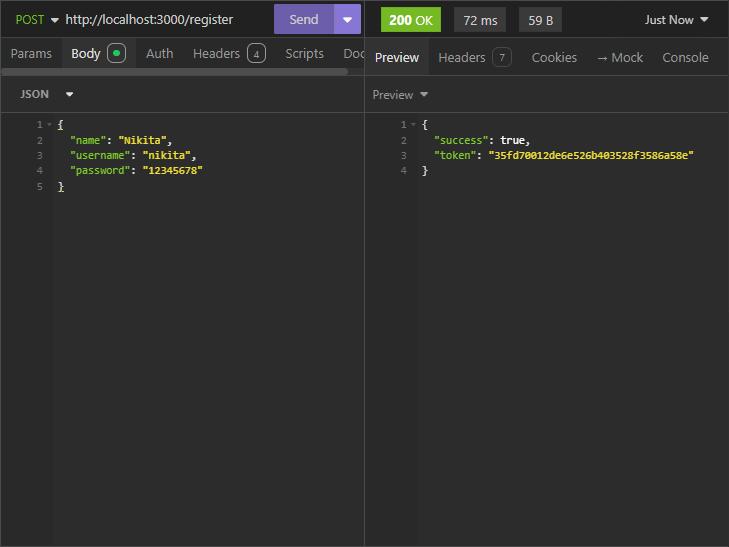

# 🔐 | Login System API

<<<<<<< HEAD
This project is a fully functional login system API built with ExpressJS. It allows users to create an account, log in, reset their session token, and delete their account.
=======
This project is a fully working login system API built with ExpressJS. You can create an account, login, reset the session token and delete the account.
>>>>>>> 1c1540a7eef7ec455c7796a3c5fd15d4a98bfc7f

## ⚙️ | Installation

To set up this project, follow these steps:

1. **Download Files:**
   Download all files from the main folder and the `functions/` subfolder, including the function files.

2. **Install Dependencies:**
   Navigate to the project folder in your terminal and run `npm install sqlite3 express` to install the required npm libraries.

3. **Run the Server:**
   Start the server by running `node .` in the project folder.

## 🖼️ | Screenshot

Screenshot of an API request being sent (registration endpoint):

 

<<<<<<< HEAD

=======
There's currently no website, only the API.
>>>>>>> 1c1540a7eef7ec455c7796a3c5fd15d4a98bfc7f

## ✉️ | Questions

If you have any questions, you can contact me on Discord: @nikitafrfr.

<<<<<<< HEAD
If you came here from the Hackclub Slack, you can reach out to me there as well :)
=======
If you came here from the Hackclub Slack, you can just contact me there :)
>>>>>>> 1c1540a7eef7ec455c7796a3c5fd15d4a98bfc7f
